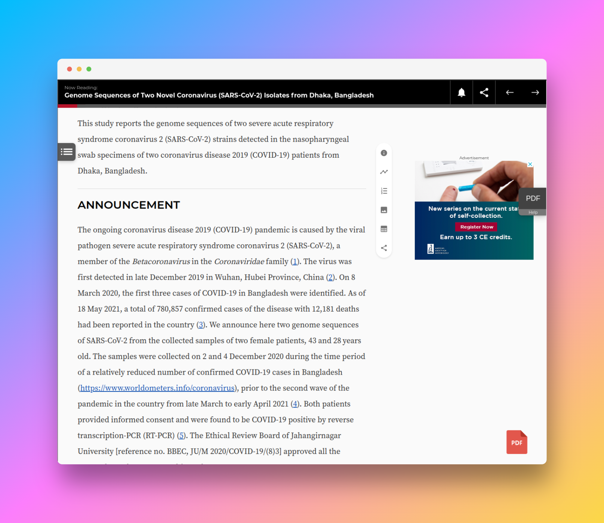

# ePDF Downloader

A simple Chrome extension that adds a **floating download button** to web pages containing links with `/doi/reader/` or `/doi/epdf/` in source html like in **ASM** or **Willey** journal article pages

## Installation
1. [Download the extension ZIP](https://github.com/nahid18/journal-epdf-downloader/releases/download/v1.0.0/epdf-downloader.zip) file from the GitHub repository.
2. Unzip the downloaded file.
3. Open Google Chrome and go to `chrome://extensions/`.
4. Turn on "Developer mode" (top right corner).
5. Click "Load unpacked" and select the unzipped folder.
6. ePDF Downloader will be added to your Chrome browser.

## Usage
1. Visit a webpage that has paper links with either `/doi/reader/` or `doi/epdf/`. Example: **Willey** or **ASM** journals.
2. Look for the floating download button in the bottom right corner.
3. If a DOI link with the specified pattern is detected, the button will appear.
4. Click the button to open a new tab and download the PDF.

## Uninstalling
1. Go to `chrome://extensions/`.
2. Find "ePDF Downloader" in the list.
3. Click "Remove" to uninstall the extension.

## Contributing
Contributions are welcome! Feel free to open an issue or create a pull request on GitHub.

## License
ePDF Downloader is licensed under the **MIT License**.

Thank you for using ePDF Downloader! If you have any questions or need support, please let us know in the Issues section. Enjoy easy PDF downloads!
